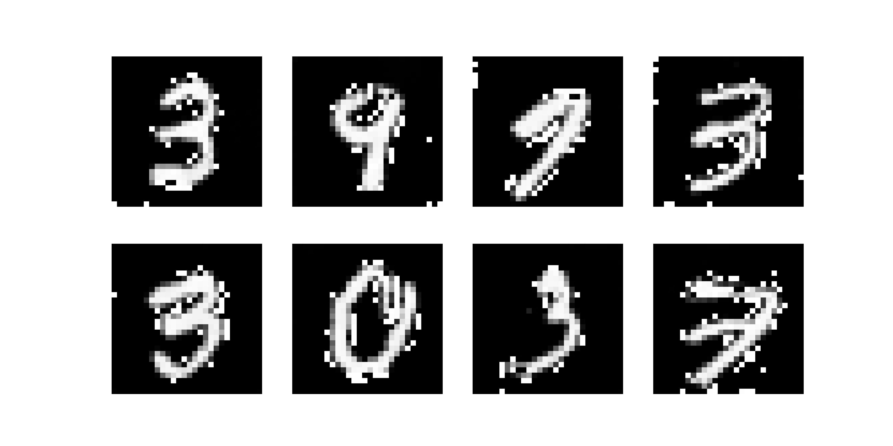
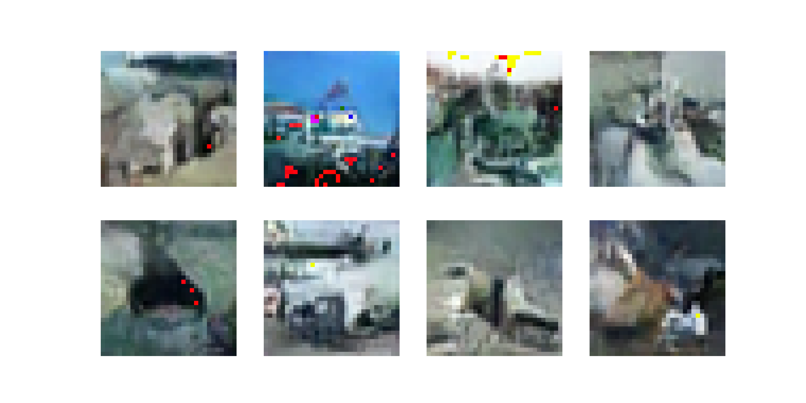
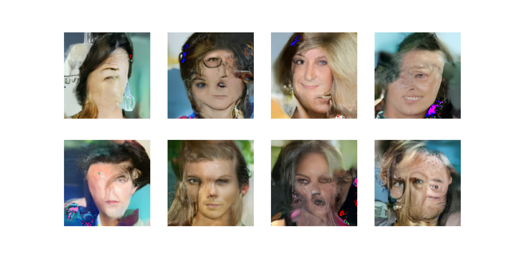

# diffusion_scratch

## Abstract
This is a repository of DDPM framework I implemented from scratch.

DDPM is important because:
- GANのような尤度が明示的に与えられないモデルは学習が不安定な傾向があるが、DDPMは安定している。
- 従来の多段階的なモデルと比較してモデルは軽量であり、学習も高速である。
- ノイズから段階的に生成する中で、各ステップでの調整や改良が可能であり、生成結果の制御性が高い。モデルが軽量であるのも併せて、応用しやすい。
  
I implemented:
- A Framework to train and evaluate DDPMs

#### Original Paper
HO, Jonathan; JAIN, Ajay; ABBEEL, Pieter. Denoising diffusion probabilistic models. Advances in neural information processing systems, 2020, 33: 6840-6851.
https://proceedings.neurips.cc/paper/2020/hash/4c5bcfec8584af0d967f1ab10179ca4b-Abstract.html

## How to use
1. Clone this repository on your local machine.
    ```
    $ git clone <URL_TO_THIS_REPOSITORY>
    $ cd diffusion_scratch
    ```
2. Open on a VSCode devcontainer. Required packages will be installed automatically.
   </br> NOTE: If you like other environment such as conda, please setup it referencing to `Dockerfile` and `.devcontainer/devcontainer.json`. 
   </br> NOTE: The versions of CUDA and torch are specified in `Dockerfile` and `re    quirements.txt` respectively. Please change them when you setup your environment if necessary.
3. Install `diffusion_scratch` library with development mode.
    ```bash
    $ pip install . -e
    ```
4. Start training and evaluation.
    ```bash
    $ cd examples
    $ python3 ./train.py <PATH_TO_CONFIG>
    ```
    Sample config files are in `configs`, and you can specify them like
    `../configs/mnist.yaml`

## Structure Overview
#### `diffusing`
A core framework for forward and reverse process
- `noising`: A package related to forward/noising process
- `sampling`: A package related to backward/denoising process 
#### `training`
A package for training diffusion models using `diffusing` package
#### `models`
A sample target model is here. You can use your own models.

## Training Results
### MNIST
epoch=50



### CIFAR10
epoch=100



### CelebA-HQ
epoch=500


